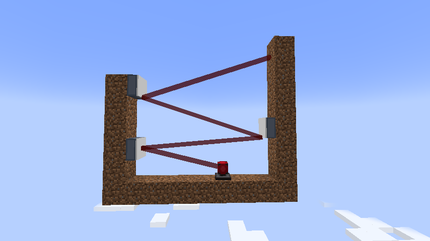
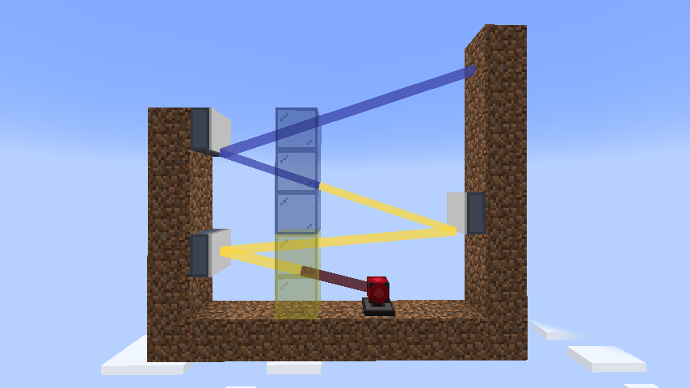
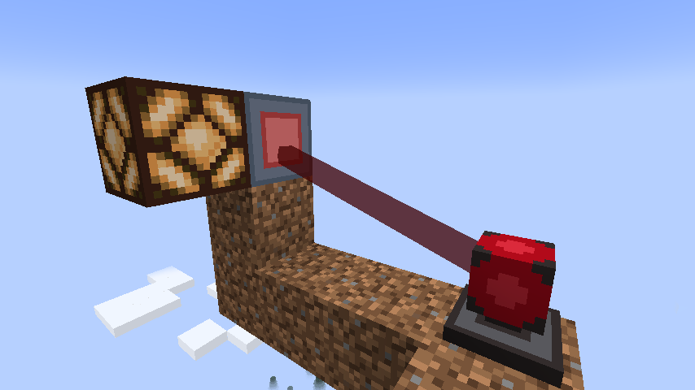

# Lina's Lasers Mod

You could say it's a new LLM! Anyway, we didn't have lasers in Minecraft yet, did we?

## Features

- **Lasers**: shoot a colored beam up the sky (or not up, it's your choice)!
- **Dyed Beams**: who said only red lasers exist?? dye them to your heart's content!
  
- **Mirrors**: let's say you don't like where this is going... just change the direction! *(Now featuring ✨vaguely realistic✨ reflection angles)*
- **Receivers**: okay, okay, this is fun and all... but can't really use them yet, yk? You actually kinda can, with the help of a *Laser Receiver* :3  
  (Outputs a 15-strength redstone signal when has a laser focused on its receiver side, marked in 🍒 red)
  

## License

This mod is licensed under CC BY-NC-SA 4.0 license: you must **give credit** and **not use it for commercial purposes**; other than that, you're free to adapt and modify **under the same terms**!